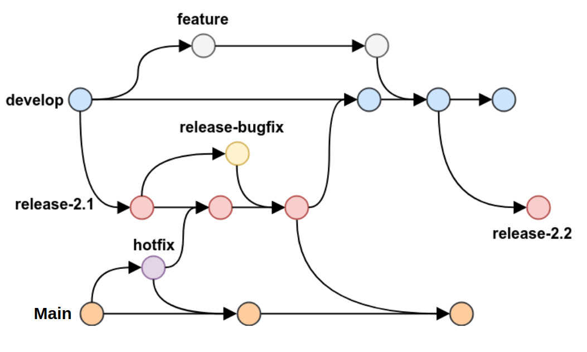

# Git Flow na prática

## O Git Flow tem que seguir a seguinte estrutura:

 

> - Branch principal => produção: Master.  
> - Branch principal => homologação: Release.  
> - Branches de suporte: Develop, Feature, Release, Bugfix e Hotfix.

 

| Branch      | Exemplo              | Descrição                                                                                                                                                                                                                                                                                                                                        |
| ----------- | -------------------- | ------------------------------------------------------------------------------------------------------------------------------------------------------------------------------------------------------------------------------------------------------------------------------------------------------------------------------------------------ |
| **Master**  | master               | Aqui é onde temos todo o código de produção. Todas as novas funcionalidades que estamos desenvolvendo, em algum momento, serão mescladas ou associadas a Master.                                                                                                                                                                                 |
| **Develop** | develop              | Aqui é onde fica o código do nosso próximo deploy. Isso significa que, como recursos ou funcionalidades, será finalizado e adicionado nesta ramificação para posteriormente passar por mais uma etapa antes de ser associado a uma Master.                                                                                                       |
| **Feature** | feature/name-feature | São branches para o desenvolvimento de uma funcionalidade específica. Elas devem ter o nome iniciado por feature, por exemplo, “feature / payment-system”. É importante saber que essas features branches são criadas sempre a partir da branch Develop. Portanto, quando finalizada, ela é removida após realizar o merge com a Branch Develop. |
| **Release** | release-0.0.0        | Serve como ponte para fazer o merge da Develop para a Master. Funciona como ambiente de homologação e é removida após realizar os testes e do merge com a Master. Caso haja alguma alteração, ela também deve ser sincronizada com a Develop.                                                                                                    |
| **Bugfix**  | bugfix/name-fix      | Uma branch criada a partir da Release para realizar correções encontradas no sistema ainda no momento desenvolvimento, Quando concluída ela é excluída após realizar o merge com a Branch Release.                                                                                                                                               |
| **Hotfix**  | hotfix/name-fix      | Uma branch criada a partir da Master para realizar correções encontradas no sistema em produção. Quando concluída ela é excluída após realizar o merge com a Branch Master e Develop.                                                                                                                                                            |

 

## Exemplo do Fluxo

 
 

[⬆ Voltar ao topo](#git-flow-na-pratica) 
